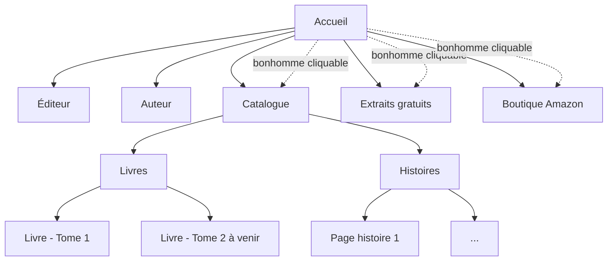

# Plan du site (sitemap)

Structure des pages et de la navigation du site. À distinguer du `sitemap.xml` technique (généré automatiquement par le plugin `jekyll-sitemap` pour l'indexation Google, voir `CLAUDE.md`) — ce fichier-ci est le plan de structure destiné à guider le développement et les échanges avec Simon.

## Structure confirmée

- **Accueil** — image de Bourtouk en grand, bonhomme cliquable (zones : main → catalogue, ventre → extraits gratuits, fesses → boutique Amazon), carousel des items `vedette: true`, menu traditionnel en parallèle du bonhomme.
- **Éditeur** — page de présentation de l'éditeur (la maison d'édition).
- **Auteur** — page de présentation de l'auteur (un seul auteur pour l'instant : Simon).
- **Catalogue** — section en deux parties (renommée depuis « Boutique » pour éviter la confusion avec la boutique Amazon) :
  - **Livres** — généré depuis la collection `_livres/`, une page par livre (front matter → template Jekyll). Contenu actuel : 1 livre publié (tome 1), tome 2 en écriture — prévu comme une trilogie.
  - **Histoires** — généré depuis la collection `_histoires/`, une page par histoire.
- **Extraits gratuits** — accès aux extraits (champ `extrait` du front matter, quand rempli).
- **Boutique Amazon** — lien externe (champ `lien_amazon` du front matter), pas une page du site.

## Pages à confirmer avec Simon

Liste du menu traditionnel pas encore arrêtée pour le reste — voir la section « Navigation / structure du site » dans `informations-a-completer.md`. Candidates possibles, à valider :

- Contact
- Mentions légales (raison sociale, politique de retour/remboursement Square, confidentialité — voir `informations-a-completer.md`)

## Notes

- Quand la liste de pages est confirmée par Simon, mettre à jour ce fichier et le diagramme ci-dessus.
- Les pages individuelles de livres/histoires ne sont pas énumérées une par une ici (elles sont générées automatiquement par Jekyll depuis les collections) — seule leur place dans la hiérarchie est représentée.
